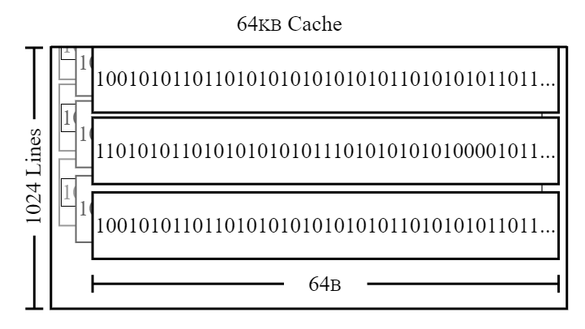
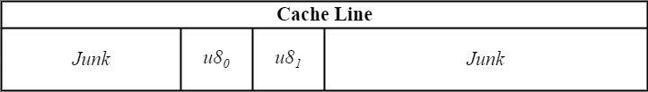
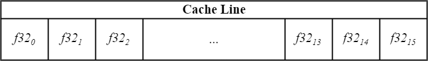
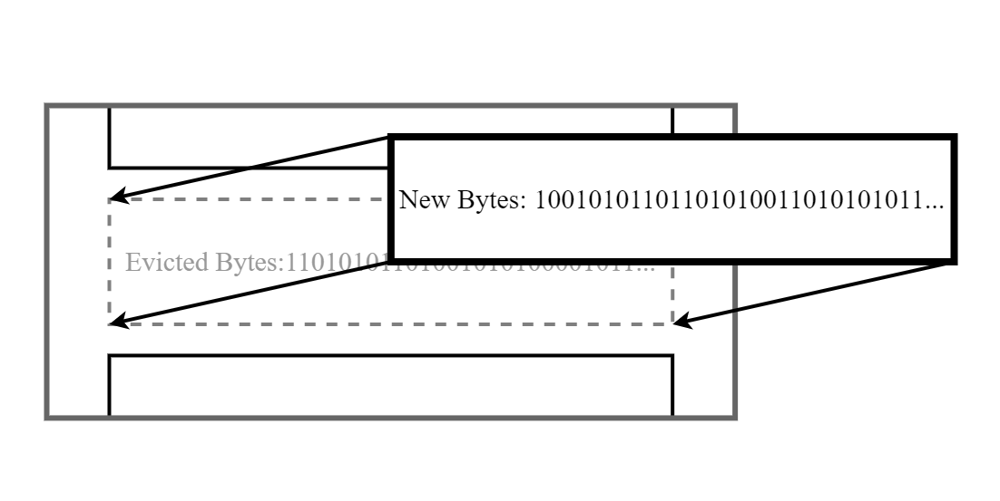
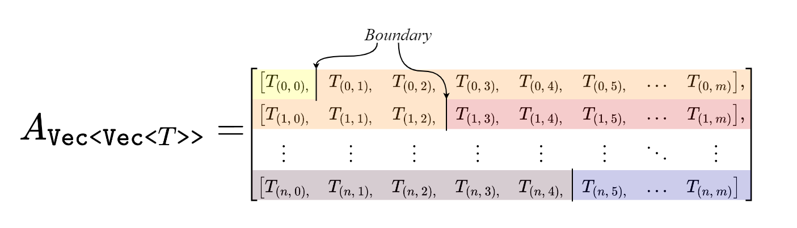
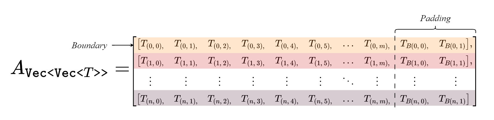

# optimizing-similarity-algorithms

An overview of optimization strategies and implementations (in Rust) for expensive, time complex algorithms.

- [optimizing-similarity-algorithms](#optimizing-similarity-algorithms)
  - [Introduction](#introduction)
  - [Problem](#problem)
  - [Naive Solution](#naive-solution)
    - [Process](#process)
    - [Performance](#performance)
  - [Cache Optimization](#cache-optimization)
    - [Cache Lines](#cache-lines)
    - [Cache Alignment](#cache-alignment)
      - [Strategy](#strategy)
      - [`Packed<T: Sized, const N: usize>`](#packedt-sized-const-n-usize)
      - [`flatten<T, const N: usize>`](#flattent-const-n-usize)
      - [`distance_self<T, const N: usize>` \& `distance_other<T, const N: usize>`](#distance_selft-const-n-usize--distance_othert-const-n-usize)
      - [Refactored Algorithm](#refactored-algorithm)
    - [Prefetching, Lifetimes, \& Iterators (TODO)](#prefetching-lifetimes--iterators-todo)
  - [Parallelization (TODO)](#parallelization-todo)
  - [SIMD (TODO)](#simd-todo)

## Introduction

The goal of this repo is to practice some optimization techniques that may be applied when there isn't much that can be done about the time complexity of some expensive algorithm. Micro benchmarks can indeed be red herrings some times, but I think that it is still good practice to reflect on ways to shave every last nano second off of an inner-most loop.

The **TL;DR** is a 2x speed up with the cache alignment strategy alone, with greater gains as data grows.

## Problem

Given an $N \times M$ matrix $A$ where $A \in \set{ ℕ \cup  ∅ } ^ {N \times M}$ and describes a set of $N$ sequences of size $M$, return distance matrix $D$ by applying some metric $f$ to every pairwise combination of sequences in $A$ assumging:

```math
\begin{align*}
    &{\large A =}
    \begin{bmatrix}
        a_{0\,0}    & a_{0\,1}  & \dots     & a_{0\,m}  \\[2pt]
        a_{1\,0}    & a_{1\,1}  & \dots     & a_{1\,m}  \\[.5pt]
        \vdots      & \vdots    & \ddots    & \vdots    \\[2pt]
        a_{n\,0}    & a_{n\,1}  & \dots     & a_{n\,m}
    \end{bmatrix}
    &{\large D =}
    \begin{bmatrix}
        d_{0\,0}    & d_{0\,1}  & \dots     & d_{0\,n}  \\[2pt]
        d_{1\,0}    & d_{1\,1}  & \dots     & d_{1\,n}  \\[.5pt]
        \vdots      & \vdots    & \ddots    & \vdots    \\[2pt]
        d_{n\,0}    & d_{n\,1}  & \dots     & d_{n\,n}
    \end{bmatrix}
\end{align*}
```

```math

\begin{array}{rll}
    \\[10pt]
    D &= d(ij) & \\[15pt]
    d: i, j &\mapsto \sum\limits_{k=1}^{M} \mathcal{f}(i, j, k) = d_{ij} & \\[15pt]
    \mathcal{f}: i, j, k &\mapsto
    \left\{
    \begin{array}{rl}
    0 & \text{if } A_{ik} = 0 \lor A_{jk} = 0 \\[8pt]
    \sum\limits_{x \in \mathcal{A}_k} 1_{\{ A_{ik} \}}(x) & \text{if } A_{ik} = A_{jk} \\
    n & \text{otherwise}
    \end{array}
    \right. & \\[10pt]
    &\hspace{50pt} \text{where } \mathcal{A}_k = \{ x \in A_k \} &
\end{array}

```

## Naive Solution

### Process

1. Treat the feature matrix $A$ as an array of arrays:
```math
\begin{bmatrix}
    [   a_{(0,0)},    & a_{(0,1)},  & a_{(0,2)},  & \dots     & a_{(0,m)}   ],  \\[2pt]
    [   a_{(1,0)},    & a_{(1,1)},  & a_{(1,2)},  & \dots     & a_{(1,m)}   ],  \\[.5pt]
        \vdots        & \vdots      & \vdots      & \ddots    & \vdots          \\[2pt]
    [   a_{(n,0)},    & a_{(n,1)},  & a_{(n,2)},  & \dots     & a_{(n,m)}   ]
\end{bmatrix}
```

2. Calculate the column-wise value counts of A:

    ```rust
    use std::collections::HashMap:

    let mut value_counts = vec![HashMap:new() ; m];

    for i in 0..n {s
        for j in 0..m {
            let val = data[i][j];

            match val {
                None => (),
                Some(val) => {
                    let count = 
                        value_counts[j].entry(val)
                                       .or_insert(0);
                    *count += 1;
                }
            }
        }
    }
    ```

3. Iterate over every array, comparing every element: [^1]

    ```rust
    // for-loop:
    for i in 0..N {
        for j in i+1..N {
            let mut distance: usize = 0;

            for k in 0..M {
                let val_i = A[i][k]
                let val_j = A[j][k]

                distance += match val_i {
                    None    => 0,
                    val_j   => value_counts[k][val_i],
                    _       => N
                };
            }

            distance_matrix[i][j] = distance
            distance_matrix[j][i] = distance
        }
    }
    ```

    ```Rust
    // functional:
    data.iter().enumerate().for_each(|(i, row_i)| {
        let row_i = row_i;
        data.iter().enumerate().skip(i).for_each(|(j, row_j)|{
            distance_matrix[i][j] = row_i.iter().zip(row_j.iter()).enumerate().filter(|(_, (val_i, val_j))| val_i.is_some() || val_j.is_some()).fold(0, |mut distance, (k, (val_i, val_j))| {
                match val_i == val_j {
                    true => distance += value_counts[k][&val_i.unwrap()],
                    _ => distance += default
                }
                distance 
            });
        });
    });
    ```

### Performance

The algorithm here has a time complexity of $\mathcal{O}(N^2 \times M)$ which is not ideal. To reiterate, the goal of this exercise is not to refactor the algorithm itself, but to explore methods of optimizing necessarily expensive operations involving nested for loops.

The algorithm, as implemented here, must iterate $\frac{1}{2}(n^2m+nm)$ times before completion. From this we can analyze the average per-iteration duration, $\small{\Delta T_i}$. Benchmarking the naive implementation of our algorithm, we find that as $N$ or $M$ grow large[^2] $\small{\Delta T_i}$ begins to increase as well. This signals that there are opportunities to improve performance by getting clever about how we think about looping through the data in memory.

## Cache Optimization

It's important to make a mental model about how data flows into, between, and out of a CPU core and primary storage.[^3] The CPU does not compute directly on bytes as they are stored in the primary memory. Instead, a series of cache memory layers (L1, L2, ...) sit between the primary storage and CPU. This layer of memory lives right next to the processor cores and is much faster than primary memory. While different processors, architectures, etc. manage the hand off of memory in and out of cache in various ways, there are a few assumptions we can make about how cache works to benefit the performance of our work.

### Cache Lines



Cache is structured as a series of cache lines. These lines are the smallest (read: only) units of data that can be inserted or removed from cache memory at a time. That means if the data in memory that is being read into cache has a smaller memory footprint than a single cache line's width (in bytes), then extra bits of (possibly junk) data will get read alongside the desired data. If the data's footprint is larger, then it gets split between multiple lines. To complicate things a bit more, cache lines are locked to address locations that are multiples of the width of the cache. To beat this to death a bit here are two examples of how data might be arranged in a cache line.





Once a level of cache fills up to capacity, it will move lines to a lower cache level or remove them entirely as new lines get inserted. This is not ideal. It is computationally expensive to evict data like this and is expecially harmful to the performance of a program if it is consistently having to move data in and out. There are caching strategies that may be employed to prioritize data in such a way that data is held in cache only for exactly as long or short as necessary.


### Cache Alignment

In an ideal situation there is no junk in the system cache. Data is aligned and packed in such a way that real estate on cache lines is fully utilized. In order to get to this happy place we need to ensure 2 things:

1. Congruity
2. Alignment

When either of these are not satisfied, additional computational load is added to the process which can be an impediment to the ability of algorithms to scale.

#### Strategy

Taking a look at how the data is structured in the naive implementation of the algorithm, only one of these requirements is satisfied by the `Vec<Vec<u8>>` data type: Congruity. When a variable or collection of variables of type **T** gets allocated in memory, the allocator will only ensure that it's location is a multiple of **N** (where **N** is the smallest multiple of 2 bytes greater than or equal to the size of **T** in bytes). While the Vec collection ensures that collected data is continuous, it does nothing about the location of data in relation to cache line pointer boundaries. What's more is that there's no gaurantee that the internal size and layout of the data will be aligned at all with cache boundaries.

To improve we must ensure the collection begins and ends at a cache line boundary. To accomplish this consider the data in terms of units of cache lines. The size of the cache **N** should be evenly divisible by the size of the data type **T** and the data should be collected and packed into **N** sized chunks. If a **T** collections's length is not evenly divisible by **N / T**, then pad the collection with some padding calue of **T**.



#### `Packed<T: Sized, const N: usize>`

Create a new struct **`Packed<T, N>`** to represent a collection of one cache line's worth of data where:

- **N**: Cache line size (in Bytes)
- **T**: The data type of of element being collected. **T** is constrained to types that implement Sized.
- **data**: An N byte long array of T, or **`[T; N / size_of::<T>()]`**.[^5]

```Rust
#[repr(simd)]
#[derive(Copy, Clone, Debug, PartialEq)]
pub struct Packed<T: Sized, const N: usize>
where [(); N / size_of::<T>()]:  
{
    pub data: [T; N / size_of::<T>()],
}

impl<T: Sized, const N: usize> Packed<T, N>
where [(); N / size_of::<T>()]: ,
      T: Copy + Default
{
    #[inline]
    pub fn new() -> Self {
        let _new = Self {
            data: [T::default(); N / size_of::<T>()],
        };
        _new
    }
    
    ...
}
```

Even though **`Packed<T, N`** sized to be **N** bytes (the width of a cache line on our system), it is not necessarily aligned to **N** byte addresses. Under the hood, **`Packed<T, N>`** is an **`N / size_of<T>`** units long byte array **`[T]`** which means that the only alignment guarantee is to **`size_of::<T>`** byte addresses. We can lean on existing guardrails here to align the struct. SIMD relies, in part, on these very same optimizations[^4] and by applying the macro:**`#[repr(simd)]`** to the struct to enforce cache alignment.[^6]

**`Packed<T, N`** is essentially a conversion tool to optimize the layout and packing of existing types. To this end the bulk of the implementations for the struct are for the trait **`From<_>`**. Below are just two of those most basic implementations. **`From<Vec<&T>>`**,  **`From<[&T]>`**, **`From<&Vec<T>>`**, **`From<&[T]>`** and their respective **`Option<_>`** counterparts were also implemented.

```Rust
impl<T: Sized, const N: usize> From<Vec<T>> for Packed<T, N>
where [(); N / size_of::<T>()]: Sized,
      T: Copy + Default
{
    #[inline]
    fn from(vec: Vec<T>) -> Self {
        let mut slice = vec.into_iter()
                           .take(N / size_of::<T>())
                           .collect::<Vec<T>>();
        
        slice.resize( N / size_of::<T>()
                    , T::default());

        Self {
            data: slice.as_slice()
                .try_into()
                .unwrap(),
        }
    }
}
```

```Rust
impl<T: Sized, const N: usize> From<[T]> for Packed<T, N>
where [(); N / size_of::<T>()]: Sized,
      T: Copy + Default,
      [T]: Sized
{
    #[inline]
    fn from(slice: [T]) -> Self {
        let mut slice: Vec<T> = slice.iter()
                                     .take(N / size_of::<T>())
                                     .cloned()
                                     .collect::<Vec<T>>();

        slice.resize( N / size_of::<T>()
                    , T::default());

        Self { 
            data: slice.as_slice()
                       .try_into()
                       .unwrap(),
        }
    }
}
// etc.
```

#### `flatten<T, const N: usize>`

Then create a function that flattens a **`Vec<Vec<T>>`** into a **`Vec<Packed<T, N>>`** collection of packed collection. The implementation here provides an enum switch for the axis by which to flatten. N.B. This isn't true column-major flattening. The rows are first chunked into groups **`N / std::mem::size_of::<T>()`** units long and then those groups are arranged in column-major fashion.

**N.B.** This function is also written to convert **`Option<T>`** into **`T::default()`** given that all non-null values are also greater than zero.

```Rust
pub fn flatten<T, const N: usize>( data: Vec<Vec<Option<T>>>
                                 , axis: FlattenAxis ) -> Vec<Packed<T, N>> 
    where [(); N / std::mem::size_of::<T>()]: Sized,
          T: Sized + Copy + Default {
    match axis {
        FlattenAxis::Column => {

            let chunk_count = data[0].len() / (N / std::mem::size_of::<T>()) + 1;
            let units_per_chunk = N / std::mem::size_of::<T>();
            let out = Vec::with_capacity((chunk_count - 1) * data.len() + 1);

            (0..chunk_count).fold(out, |out, i|  {
                let skip = i * units_per_chunk;
                let take = std::cmp::min(data[0].len(), (i + 1) * units_per_chunk);

                data.iter()
                    .fold(out, |mut out, row| {
                        let chunk = row.iter()
                            .skip(skip)
                            .take(take)
                            .map(|x| x.unwrap_or_default())
                            .collect::<Vec<T>>();
                        out.push(Packed::from(chunk));
                        out
                    })
            })
        },
        FlattenAxis::Row => {

            data.iter()
                .map(|row| Packed::from(row.clone()))
                .collect()

        }
    }
}
```

#### `distance_self<T, const N: usize>` & `distance_other<T, const N: usize>`

Create functions to represent the distance metric comparing two sequences to each other. The function has been modified to compare one chunk at a time. This is a change that enables us to take full advantage Rust's built in functional optimizations given the guarantee that the size of the expensive comparisons never grows beyond a single unit of cache memory. Create a new **`distance_self`** to leverage the insight that there are fewer branches required to calculate the diagonal values of the distance matrix,

```Rust
#[inline]
pub fn distance_self<T, const N: usize>
    ( data: &Packed<T, N>
    , value_count: &Vec<HashMap<T, u128>>
    , kk: usize
    , take: usize) -> u128
    where [(); N / std::mem::size_of::<T>()]: Sized,
          T: Sized + Copy + Default + Eq + Hash + PartialEq<T> {

    data.iter()
        .take(take)
        .enumerate()
        .filter(|(_, x)| x != &&T::default())
        .fold(0, |distance, (i, val)| {
        distance + match val == &default {
            true => 0,
            _ =>  value_count[kk * (N / std::mem::size_of::<T>()) + i][val],
        };
    })
}
```

```Rust
#[inline]
pub fn distance_other<T, const N: usize>
    ( data_a: &Packed<T, N>
    , data_b: &Packed<T, N>
    , value_count: &Vec<HashMap<T, u128>>
    , kk: usize
    , take: usize
    , default: u128) -> u128
    where [(); N / std::mem::size_of::<T>()]: Sized,
          T: Sized + Clone + Copy + Default + Eq  + Hash + PartialEq<T> {
    data_a.iter()
        .zip(data_b.iter())
        .take(take)
        .enumerate()
        .filter(|(_, (a, b))| a != &&T::default() || b != &&T::default())
        .fold(0, |distance, (k, (a, b))| {
            distance + match a == b {
                true => value_count[kk * (N / std::mem::size_of::<T>()) + k][a],
                false => default,
            }
        })
}
```

#### Refactored Algorithm

Now we can look at the loop structure knowing what we know about cache real estate and our cache-line-chunked flattened data.

First, flatten the data in "column-major" fashion in order to minimize the distance between chunks of data being compared. Then return sum the pair-wise distances between the k-th chunk for all rows i and j.

```Rust
let mut distance_matrix2 = vec![vec![0 as u128; n]; n];
let flattened = flatten::<u8, 64>(data, FlattenAxis::Column);
let chunk_count = flattened.len() / n;

for kk in 0..chunk_count {
    let take = std::cmp::min(m - 64 * kk, 64);
    for i in 0..n {
        let data_i = flattened[kk * 64 + i];
        distance_matrix[i][i] += distance_self(&data_i, &value_counts, kk, take);
        for j in i+1..n {
            let data_j = flattened[kk * n + j];
            distance_matrix[i][j] += distance_other(&data_i, &data_j, &value_counts, kk, take, default);
        }
    }
}
```

And there we go. Not only is this 2x as fast but it's advantage increases as $N$ and $M$ grow large due to the introduced scalability.

### Prefetching, Lifetimes, & Iterators (TODO)

## Parallelization (TODO)

## SIMD (TODO)

[^1]: I read often that Rust rewards a more functional approach to collection iterations. This is often the case. However in this example, it made no difference compared to the idiomatic, for-loop, style implementation.
[^2]: While still fitting comforatbly inside 16GB, 3733MHz DDR4 Memory
[^3]: I'm leaving out secondary storage from this here on purpose. Perhaps in a future project I can explore secondary memory, disc spilling, file spec and strategy.
[^4]: Data must be aligned to SIMD lanes for a lot of that instruction set to work. These lanes are cache-aligned, a fact being exploited.
[^5]: For some reason, I was unable to get this to work as a tuple type. I'm still looking into it.
[^6]: `#[repr(${cache_line_size})]` would also work, but `${cache_line_size}` needs to be hardcoded. Either option is a little hacky and by no means the most idiomatic way to go about it. Implementing that is outside of the scope of the exercise for now.
